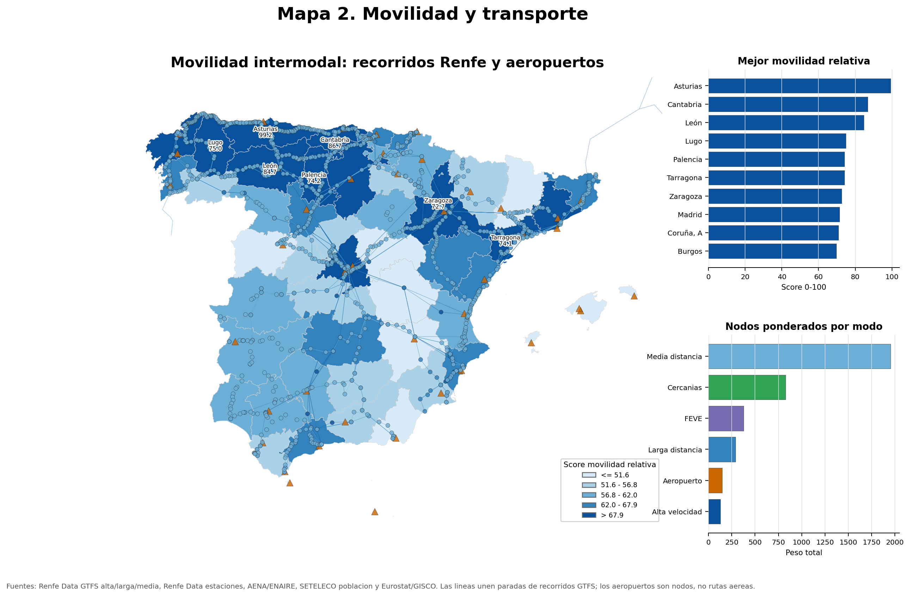

\newpage

# Resumen

Este trabajo estudia qué provincias españolas ofrecen un equilibrio razonable para una persona que termina el Máster de IA en la UPV y se plantea dónde vivir. La pregunta no se reduce a encontrar el alquiler más barato: también importa la movilidad intermodal, si existe infraestructura suficiente para teletrabajar, si se está cerca de ecosistemas tecnológicos y si las condiciones climáticas son habitables a largo plazo.

Para responderla se integran datos de alquiler municipal del MIVAU, estaciones y recorridos GTFS de Renfe, aeropuertos AENA/ENAIRE, cobertura de banda ancha del Ministerio para la Transformación Digital, temperatura histórica de NASA POWER y cartografía administrativa de Eurostat/GISCO. El resultado son seis mapas provinciales, todos con coropletas de al menos cinco clases, acompañados por capas interactivas, gráficas de apoyo y un índice sintético final.

La lectura principal es que las grandes provincias tecnológicas no siempre son las mejores desde el punto de vista residencial. Madrid, Barcelona, Bizkaia, Gipuzkoa o Málaga concentran oportunidades y buena conectividad, pero también soportan precios elevados. En cambio, otras provincias aparecen como alternativas competitivas cuando se ponderan alquiler, movilidad, disponibilidad, conectividad y confort climático.

# Introducción

## Problema de análisis

La decisión de dónde vivir después de un máster en inteligencia artificial tiene una dimensión espacial clara. Un perfil técnico puede buscar empleo presencial o híbrido en hubs consolidados, pero también puede teletrabajar si la infraestructura digital del territorio lo permite. Al mismo tiempo, el alquiler condiciona la viabilidad real de cualquier destino: una provincia con mucha actividad tecnológica puede no ser atractiva si el coste de entrada es demasiado alto o si el mercado se está tensionando con rapidez.

El objetivo del informe es construir una lectura geográfica integrada de España a escala provincial. La escala provincial permite combinar fuentes heterogéneas con menos ruido que la escala municipal, mantiene suficiente detalle territorial y facilita la comparación entre mapas. Cuando los datos originales son municipales, se agregan mediante pesos para no perder la información de base.

La pregunta de trabajo es:

> Qué provincias ofrecen mejor equilibrio entre coste de vivienda, movilidad intermodal, accesibilidad a ecosistemas tecnológicos, conectividad para teletrabajo y confort climático para un perfil universitario de IA.

## Fuentes de datos

Las fuentes utilizadas combinan repositorios oficiales, una API científica y cartografía administrativa europea:

| Ámbito | Fuente | Escala original | Rango | Uso en el informe |
|---|---:|---:|---:|---|
| Alquiler | MIVAU, Sistema Estatal de Referencia del Precio del Alquiler de Vivienda | Municipal | 2024 | Precio actual, percentiles y viviendas observadas |
| Movilidad | Renfe Data, AENA/ENAIRE | Estaciones, recorridos GTFS y aeropuertos | 2024-2026 | Nodos intermodales, recorridos y acceso estratégico |
| Conectividad | SETELECO / Ministerio para la Transformación Digital | Municipal, provincial y otras escalas | 2021-2024 | Cobertura de hogares por tecnología fija y móvil |
| Clima | NASA POWER, parámetro T2M | Punto representativo provincial | 1995-2024 | Temperatura media estacional y confort climático |
| Cartografía | Eurostat/GISCO NUTS 2024 y LAU 2024 | Provincia y municipio | 2024 | Geometrías para coropletas, puntos y cálculos espaciales |

El fichero principal de alquiler contiene 531.585 registros, 9 columnas, 7.331 municipios y 52 provincias. Sus columnas principales son código de provincia, provincia, código municipal, nombre del municipio, elemento medido, tipo de vivienda, tipo de medida, año y valor. Para movilidad se combinan estaciones ferroviarias, recorridos GTFS de alta velocidad, larga distancia y media distancia, y aeropuertos. Para la conectividad se usa un libro Excel oficial de cobertura 2021-2024, especialmente la hoja municipal por hogares. Para el clima se construye una tabla provincial de 52 filas a partir de la API mensual de NASA POWER. La cartografía provincial se toma de NUTS3 2024, y la municipal de LAU 2024 se usa para el mapa de conectividad y para ubicar puntos representativos del mapa de alquiler.

## Criterio metodológico

La memoria no busca producir seis mapas independientes, sino una narrativa de decisión. Por eso cada mapa responde a una pregunta distinta:

1. Cuánto cuesta alquilar ahora y dónde hay dispersión interna.
2. Qué zonas combinan transporte ferroviario, aeropuertos y accesibilidad estratégica.
3. Qué provincias quedan cerca de hubs tecnológicos o de IA.
4. Dónde la conectividad permite teletrabajo avanzado.
5. Qué provincias tienen condiciones climáticas más confortables.
6. Qué destinos salen mejor al integrar todos los criterios.

# Preparación de los datos

## Limpieza y normalización

La preparación se realizó con `pandas` y `GeoPandas`. En primer lugar, se homogeneizaron códigos territoriales, nombres de provincia y tipos numéricos. Esta fase es importante porque las fuentes no comparten exactamente el mismo formato: los datos de MIVAU están a escala municipal y separados por tipo de vivienda y medida; la conectividad llega en hojas de Excel; la cartografía NUTS3 tiene códigos europeos; y NASA POWER devuelve series temporales por coordenadas.

En el alquiler se filtraron los registros de precio y vivienda observada. Para el precio actual se utilizaron percentiles 25, mediana y 75; y como peso de agregación se empleó el recuento de viviendas. Este criterio evita que municipios con pocos registros tengan la misma influencia que mercados mucho mayores. En movilidad se separaron nodos de alta velocidad, larga distancia, media distancia, Cercanías, FEVE y aeropuertos. El score combina cercanía a nodos estratégicos, volumen ponderado de nodos y densidad por población para evitar que el mapa sea solo una lectura demográfica o, al contrario, que penalice demasiado a provincias muy pobladas.

## Agregación espacial

Los datos municipales de alquiler se agregaron a provincia mediante medias ponderadas. También se calcularon medidas de dispersión, como el rango intercuartil aproximado y la diferencia entre municipios extremos dentro de cada provincia. Esto permite detectar provincias cuyo promedio oculta tensiones locales.

La cartografía NUTS3 se preparó para coincidir con el dato provincial. En territorios insulares se usó `dissolve` cuando era necesario agrupar geometrías. Para las capas municipales se utilizaron puntos interiores con `representative_point()`, una opción más estable que el centroide cuando la geometría es irregular o multipoligonal.

## Reproyecciones y cálculos geométricos

Para representar mapas web se mantuvo `EPSG:4326`, pero los cálculos de distancia del mapa 3 se hicieron en `EPSG:3035`, una proyección adecuada para medir distancias en Europa. Después se devolvieron las capas a coordenadas geográficas para publicarlas en Folium.

El mapa de accesibilidad a hubs tecnológicos utiliza `sjoin_nearest()` para asignar a cada provincia el hub más cercano, `buffer()` para crear áreas de influencia y `clip()` para recortarlas al contorno de España. Además cruza esa proximidad con el alquiler medio ponderado para distinguir provincias cercanas y asequibles frente a provincias cercanas pero caras o baratas pero lejanas.

## Clasificación de coropletas

Todos los mapas de coropletas usan al menos cinco intervalos, como exige el enunciado. Se aplican criterios distintos según la variable:

- Cuantiles para comparar distribuciones relativas, como precio de alquiler o índice final.
- Intervalos definidos por usuario cuando existe una lectura operativa, como la cobertura de 1 Gbps o la distancia a hubs.
- Cortes naturales de Jenks para el confort climático, porque la temperatura presenta agrupaciones territoriales no lineales.
- Cuantiles también para movilidad, donde el score combina cercanía a nodos estratégicos, volumen ponderado de nodos y densidad de nodos por población.

# Visualización de datos

## Mapa 1. Precio actual del alquiler y dispersión interna

El primer mapa representa el precio mensual del alquiler en 2024. La coropleta provincial se complementa con puntos municipales cuyo color indica precio y cuyo tamaño resume viviendas observadas. Esta combinación permite evitar una lectura demasiado plana del territorio: una provincia puede parecer moderada en promedio y, aun así, contener municipios muy tensionados.

Las provincias más caras en el cálculo ponderado son Madrid, Barcelona, Gipuzkoa, Illes Balears y Bizkaia. En el extremo inferior aparecen Lugo, Ourense, Ciudad Real, Zamora y Teruel. La diferencia entre ambos grupos muestra que el coste residencial sigue una lógica metropolitana y litoral, pero también que el interior conserva mercados más asequibles.

Técnicas principales: `merge` entre datos y geometría, agregación ponderada, cálculo de percentiles, cuantiles de cinco clases, puntos municipales con `representative_point()`, tooltips y popups HTML en Folium.

Salida interactiva: `../1_precio_medio_alquiler_provincia/salidas/mapa1_alquiler_provincias_interactivo.html`.

## Mapa 2. Movilidad y transporte

El segundo mapa introduce movilidad intermodal. La coropleta provincial muestra un `mobility_score` relativo entre 0 y 100 que combina cercanía a nodos estratégicos, volumen ponderado de nodos y densidad de transporte normalizada por población. Por tanto, una provincia clara no debe interpretarse automáticamente como una provincia sin movilidad, sino como una posición baja dentro de esta comparación concreta.

La capa de puntos muestra estaciones de alta velocidad, larga distancia, media distancia, Cercanías, FEVE y aeropuertos en grupos `MarkerCluster`. Las líneas visibles ya no son una red ferroviaria completa, sino recorridos derivados del GTFS de Renfe y unidos por secuencias de paradas. Los aeropuertos se tratan como nodos estratégicos, no como rutas aéreas. Esta lectura ayuda a detectar provincias asequibles que no quedan desconectadas del resto del territorio.

Técnicas principales: distancia al nodo estratégico más cercano, volumen de nodos en escala logarítmica, normalización por población, coropleta de cinco cuantiles en escala azul, recorridos GTFS por modo, `MarkerCluster`, capas checkbox filtrables, tooltips y popups con fuente.

Salida interactiva: `../2_evolucion_alquiler/salidas/mapa2_movilidad_transportes_interactivo.html`.

## Mapa 3. Accesibilidad laboral a hubs tech/IA

El tercer mapa tiene un papel complementario. No pretende medir el mercado laboral real, sino aportar un proxy espacial de accesibilidad a hubs tecnológicos o de IA: Valencia/UPV, Madrid, Barcelona, Málaga, Bilbao, Sevilla y Zaragoza. A partir de esa capa metodológica se calcula la distancia euclídea de cada provincia al hub más cercano y se compara con el alquiler medio ponderado de 2024.

La lectura se limita a detectar un compromiso sencillo para trabajo híbrido o contactos puntuales: provincias a 175 km o menos del hub más cercano y con alquiler igual o inferior a la media nacional ponderada se resaltan como candidatas. La interpretación debe ser prudente, porque el mapa no mide ofertas reales, rutas por carretera, transporte público ni tiempos de viaje.

Técnicas principales: reproyección a `EPSG:3035`, `sjoin_nearest()`, anillos de influencia, líneas provincia-hub, cuadrantes distancia-alquiler, capa de candidatas híbridas, capas apagables, herramienta de medición y `Draw(export=False)` en Folium.

Salida interactiva: `../3_accesibilidad_laboral_tech/salidas/mapa3_accesibilidad_laboral_tech_interactivo.html`.

## Mapa 4. Conectividad para teletrabajo e IA

El cuarto mapa se rediseña como filtro tecnológico municipal, pero se simplifica visualmente para no saturar la lectura. En lugar de limitarse a una coropleta provincial de 1 Gbps, permite alternar entre tres conexiones terrestres: WiFi/fijo, 4G y 5G. En el modo WiFi/fijo, un slider discreto permite cambiar entre los umbrales oficiales de 30 Mbps, 100 Mbps y 1 Gbps.

La lectura principal queda en dos planos: cobertura terrestre municipal y cobertura satelital general superpuesta. La capa satelital se representa mediante bandas diagonales inspiradas en la idea de cobertura no cableada basada en Conéctate35/Hispasat. No compite con la fibra ni modela huellas físicas de satélite; funciona como referencia visual de respaldo general.

Técnicas principales: unión municipal LAU-CMUN, selector HTML/JavaScript de conexión terrestre, slider discreto de velocidad fija, capa satelital con bandas diagonales, popups HTML con barras por conexión, `Search`, `MiniMap`, `Fullscreen` y `MeasureControl`.

Salida interactiva: `../4_conectividad_teletrabajo/salidas/mapa4_conectividad_teletrabajo_interactivo.html`.

## Mapa 5. Confort climático estacional

El quinto mapa incorpora una dimensión de calidad de vida. Se calcula la temperatura media estacional entre 1995 y 2024 y se deriva un índice de confort climático. Esta variable tiene menos peso que la vivienda o la conectividad, pero ayuda a distinguir destinos que serían similares en términos económicos.

Córdoba, Alicante/Alacant, Almería, València/Valencia y Jaén obtienen las puntuaciones climáticas más altas según el criterio usado. Cantabria, León, Burgos, Palencia y Soria quedan en la parte baja. Conviene interpretar este resultado como confort térmico medio, no como evaluación completa de riesgos climáticos, humedad, olas de calor o preferencias personales.

Técnicas principales: consulta a API, medias ponderadas por días de mes, cortes naturales de Jenks, `TimeSliderChoropleth`, marcadores circulares, etiquetas dinámicas y tooltips estacionales.

Salida interactiva: `../5_confort_climatico/salidas/mapa5_confort_climatico_estacional_interactivo.html`.

## Mapa 6. Índice final de destino residencial tech

El sexto mapa sintetiza el proyecto. El índice final combina cuatro componentes normalizados entre 0 y 100: alquiler bajo, movilidad relativa, conectividad de 1 Gbps y confort climático. Los pesos iniciales son 41,18%, 23,53%, 23,53% y 11,76%, respectivamente. La disponibilidad del mercado se conserva como dato informativo, pero no aporta a la media final.

El ranking resultante sitúa en cabeza a Ciudad Real, Badajoz, Asturias, Jaén y Lugo. Esta salida no significa que las provincias peor clasificadas sean malas opciones absolutas: muchas tienen ecosistemas laborales fuertes. Lo que indica es que, bajo los pesos elegidos, el equilibrio residencial favorece provincias de coste contenido, movilidad suficiente y conectividad razonable.

Técnicas principales: normalización min-max, inversión de variables cuando un valor bajo es favorable, índice compuesto ponderado, coropleta de cinco cuantiles, ranking top 10, popups con desglose de componentes y app Streamlit con pesos ajustables.

Salida interactiva: `../6_indice_destino_tech/salidas/mapa6_indice_destino_tech_interactivo.html`.

# Conclusiones

La primera conclusión es que el precio del alquiler sigue siendo el factor que más condiciona la decisión residencial. Madrid, Barcelona y varias provincias vascas concentran precios altos, mientras que Lugo, Ourense, Ciudad Real, Zamora y Teruel mantienen niveles más accesibles. Para un egresado reciente, esta diferencia puede ser más determinante que pequeñas variaciones en clima o conectividad.

La segunda conclusión es que no basta con mirar el precio actual. La movilidad añade una capa residencial distinta: una provincia barata puede ser interesante, pero pierde atractivo si queda aislada de estaciones estratégicas, aeropuertos o recorridos ferroviarios.

La tercera conclusión es que la conectividad abre oportunidades fuera de los grandes hubs. Muchas provincias no metropolitanas tienen cobertura de 1 Gbps suficientemente alta para teletrabajo o trabajo híbrido. Sin embargo, todavía hay territorios que combinan alquiler bajo con brecha digital, por lo que el mapa de conectividad actúa como filtro necesario antes de recomendar un destino.

La cuarta conclusión, más secundaria, es que la proximidad a hubs tecnológicos y el índice final no siempre coinciden. Estar cerca de Madrid, Barcelona, Bilbao, Málaga o Valencia puede mejorar la exposición a eventos, universidades y redes profesionales, pero suele venir acompañado de costes residenciales más altos. Por eso esta capa se usa como contexto, mientras que la recomendación final descansa sobre vivienda, movilidad, conectividad, disponibilidad y confort climático.

Como recomendación general, Ciudad Real, Badajoz, Asturias, Jaén y Lugo forman el grupo inicial de destinos competitivos bajo los pesos propuestos. No coinciden necesariamente con los lugares con más empleo tecnológico presencial, pero sí representan una combinación atractiva de alquiler contenido, movilidad suficiente, conectividad aceptable y calidad de vida. El análisis muestra que las alternativas al eje Madrid-Barcelona son reales y medibles, especialmente para perfiles que puedan teletrabajar o mantener una relación laboral híbrida con los principales hubs.

Aun así, la elección final depende mucho de las preferencias de cada persona. No todo el mundo valora igual el ahorro en alquiler, la cercanía a empresas tecnológicas, el clima, el tamaño de la ciudad, la vida cultural, la movilidad, la proximidad a familia y amistades o la posibilidad de construir una red profesional presencial. Para alguien que priorice oportunidades laborales inmediatas, Madrid, Barcelona, Málaga, Bilbao o Valencia pueden seguir siendo opciones muy atractivas aunque tengan peor puntuación residencial. Para otra persona que busque estabilidad económica, menor presión de gasto y buena conexión para trabajar en remoto, provincias con menor coste pueden resultar mucho más adecuadas.

Por eso, el índice final debe entenderse como una herramienta de apoyo a la decisión, no como una respuesta única. Su utilidad está en ordenar variables comparables y hacer visibles los compromisos entre vivienda, movilidad, conectividad, accesibilidad laboral y confort climático. La mejor provincia no es necesariamente la que obtiene la puntuación más alta para todos los casos, sino la que encaja mejor con el proyecto vital y profesional de cada persona.

# Referencias de datos

- MIVAU. Sistema Estatal de Referencia del Precio del Alquiler de Vivienda. `VDP001_01.csv`.
- Renfe Data. Listado completo de estaciones y GTFS de alta velocidad, larga distancia y media distancia.
- AENA/ENAIRE. Aeropuertos españoles usados como nodos estratégicos.
- Ministerio para la Transformación Digital y de la Función Pública / SETELECO. Cobertura Banda Ancha España 2021-2024.
- NASA POWER. Monthly API, parámetro `T2M`, período 1995-2024.
- Eurostat/GISCO. NUTS 2024, nivel 3, escala 1:1M.
- Eurostat/GISCO. LAU 2024, escala 1:1M.
