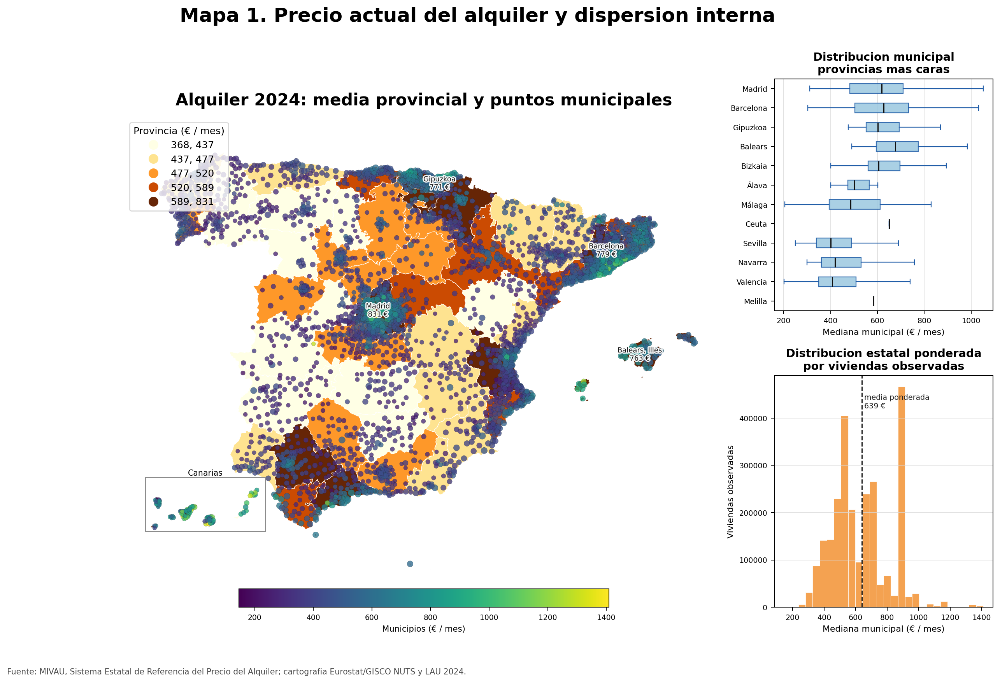
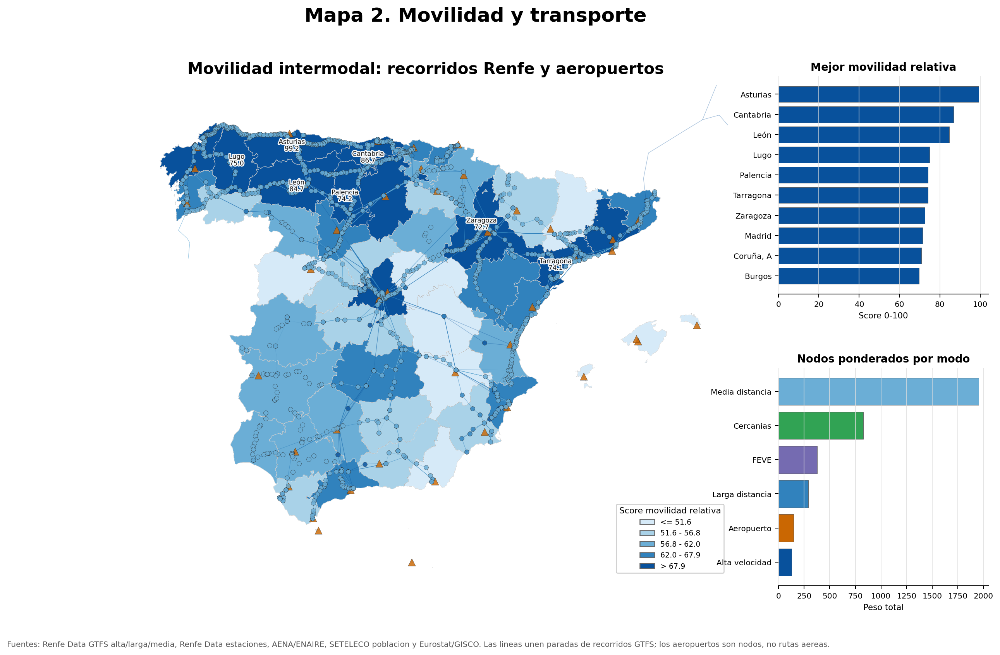
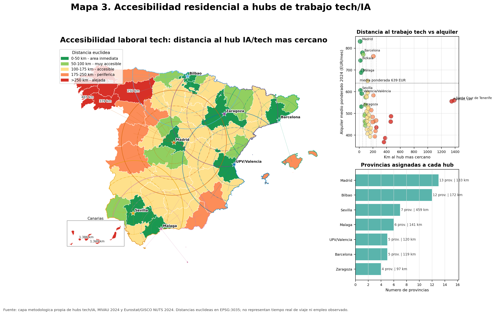
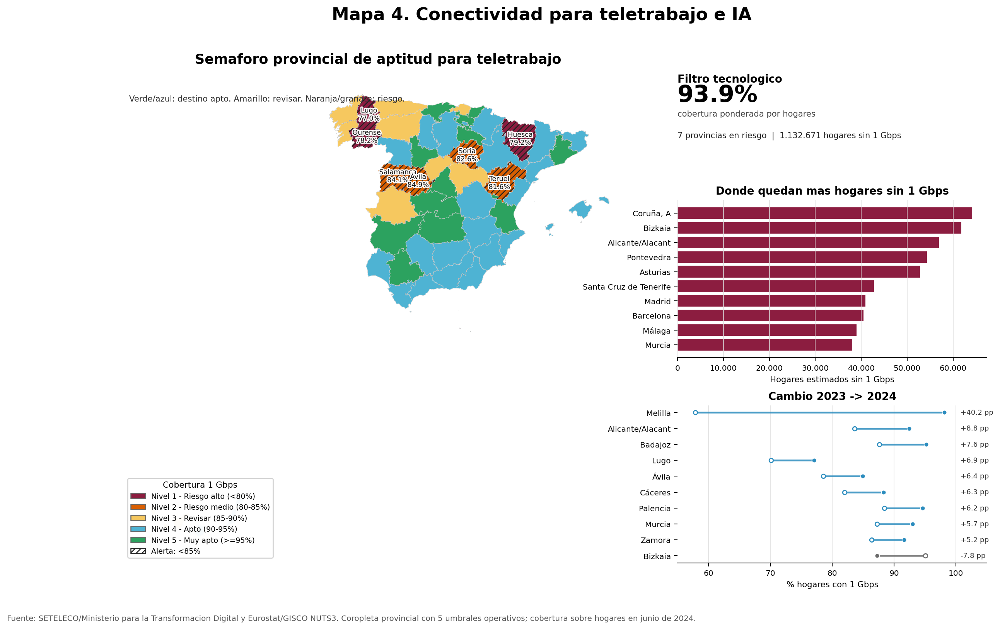
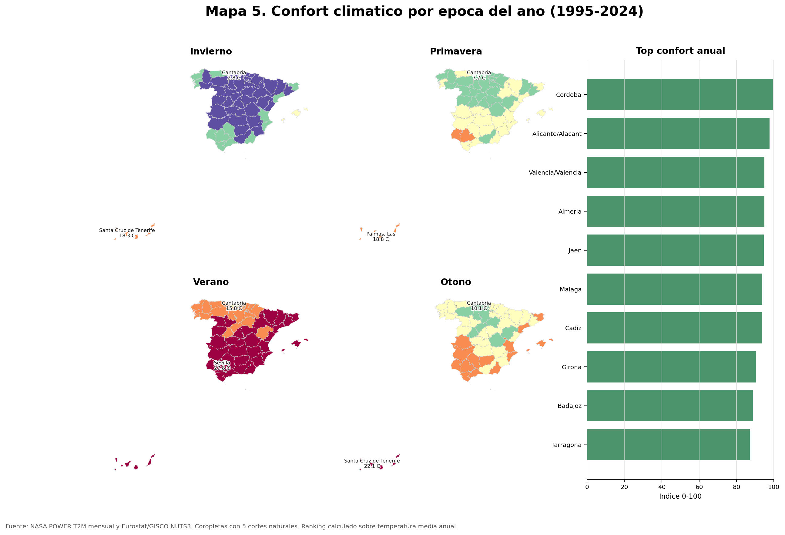
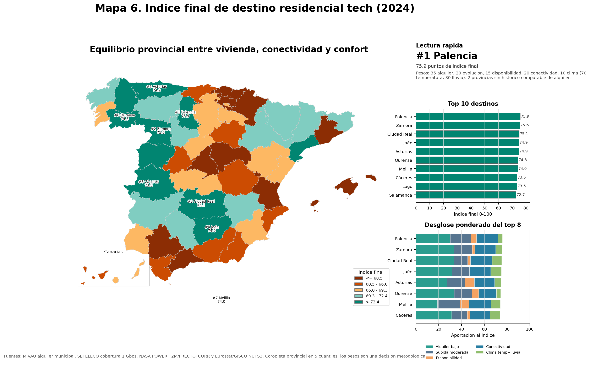

\newpage

# Resumen

Este trabajo estudia que provincias espanolas ofrecen un equilibrio razonable para una persona que termina el Master de IA en la UPV y se plantea donde vivir. La pregunta no se reduce a encontrar el alquiler mas barato: tambien importa si el mercado residencial es estable, si existe infraestructura suficiente para teletrabajar, si se esta cerca de ecosistemas tecnologicos y si las condiciones climaticas son habitables a largo plazo.

Para responderla se integran datos de alquiler municipal del MIVAU, cobertura de banda ancha del Ministerio para la Transformacion Digital, temperatura historica de NASA POWER y cartografia administrativa de Eurostat/GISCO. El resultado son seis mapas provinciales, todos con coropletas de al menos cinco clases, acompanados por capas interactivas, graficas de apoyo y un indice sintetico final.

La lectura principal es que las grandes provincias tecnologicas no siempre son las mejores desde el punto de vista residencial. Madrid, Barcelona, Bizkaia, Gipuzkoa o Malaga concentran oportunidades y buena conectividad, pero tambien soportan precios elevados o trayectorias de encarecimiento. En cambio, provincias como Asturias, Jaen, Ciudad Real, Zamora u Ourense aparecen como alternativas competitivas cuando se ponderan alquiler, estabilidad, disponibilidad, conectividad y confort climatico.

# Introduccion

## Problema de analisis

La decision de donde vivir despues de un master en inteligencia artificial tiene una dimension espacial clara. Un perfil tecnico puede buscar empleo presencial o hibrido en hubs consolidados, pero tambien puede teletrabajar si la infraestructura digital del territorio lo permite. Al mismo tiempo, el alquiler condiciona la viabilidad real de cualquier destino: una provincia con mucha actividad tecnologica puede no ser atractiva si el coste de entrada es demasiado alto o si el mercado se esta tensionando con rapidez.

El objetivo del informe es construir una lectura geografica integrada de Espana a escala provincial. La escala provincial permite combinar fuentes heterogeneas con menos ruido que la escala municipal, mantiene suficiente detalle territorial y facilita la comparacion entre mapas. Cuando los datos originales son municipales, se agregan mediante pesos para no perder la informacion de base.

La pregunta de trabajo es:

> Que provincias ofrecen mejor equilibrio entre coste de vivienda, evolucion del alquiler, accesibilidad a ecosistemas tecnologicos, conectividad para teletrabajo y confort climatico para un perfil universitario de IA.

## Fuentes de datos

Las fuentes utilizadas combinan repositorios oficiales, una API cientifica y cartografia administrativa europea:

| Ambito | Fuente | Escala original | Rango | Uso en el informe |
|---|---:|---:|---:|---|
| Alquiler | MIVAU, Sistema Estatal de Referencia del Precio del Alquiler de Vivienda | Municipal | 2011-2024 | Precio actual, percentiles, viviendas observadas y evolucion temporal |
| Conectividad | SETELECO / Ministerio para la Transformacion Digital | Provincial y otras escalas | 2021-2024 | Cobertura de hogares con banda ancha fija >= 1 Gbps |
| Clima | NASA POWER, parametro T2M | Punto representativo provincial | 1995-2024 | Temperatura media estacional y confort climatico |
| Cartografia | Eurostat/GISCO NUTS 2024 y LAU 2024 | Provincia y municipio | 2024 | Geometrias para coropletas, puntos y calculos espaciales |

El fichero principal de alquiler contiene 531.585 registros, 9 columnas, 7.331 municipios y 52 provincias. Sus columnas principales son codigo de provincia, provincia, codigo municipal, nombre del municipio, elemento medido, tipo de vivienda, tipo de medida, ano y valor. Para la conectividad se usa un libro Excel oficial de cobertura 2021-2024. Para el clima se construye una tabla provincial de 52 filas a partir de la API mensual de NASA POWER. La cartografia provincial se toma de NUTS3 2024, y la municipal de LAU 2024 se usa para ubicar puntos representativos.

## Criterio metodologico

La memoria no busca producir seis mapas independientes, sino una narrativa de decision. Por eso cada mapa responde a una pregunta distinta:

1. Cuanto cuesta alquilar ahora y donde hay dispersion interna.
2. Donde se esta encareciendo mas el alquiler.
3. Que provincias quedan cerca de hubs tecnologicos o de IA.
4. Donde la conectividad permite teletrabajo avanzado.
5. Que provincias tienen condiciones climaticas mas confortables.
6. Que destinos salen mejor al integrar todos los criterios.

# Preparacion de los datos

## Limpieza y normalizacion

La preparacion se realizo con `pandas` y `GeoPandas`. En primer lugar, se homogeneizaron codigos territoriales, nombres de provincia y tipos numericos. Esta fase es importante porque las fuentes no comparten exactamente el mismo formato: los datos de MIVAU estan a escala municipal y separados por tipo de vivienda y medida; la conectividad llega en hojas de Excel; la cartografia NUTS3 tiene codigos europeos; y NASA POWER devuelve series temporales por coordenadas.

En el alquiler se filtraron los registros de precio y vivienda observada. Para el precio actual se utilizaron percentiles 25, mediana y 75; para la evolucion se uso la mediana; y como peso de agregacion se empleo el recuento de viviendas. Este criterio evita que municipios con pocos registros tengan la misma influencia que mercados mucho mayores.

## Agregacion espacial

Los datos municipales de alquiler se agregaron a provincia mediante medias ponderadas. Tambien se calcularon medidas de dispersion, como el rango intercuartil aproximado y la diferencia entre municipios extremos dentro de cada provincia. Esto permite detectar provincias cuyo promedio oculta tensiones locales.

La cartografia NUTS3 se preparo para coincidir con el dato provincial. En territorios insulares se uso `dissolve` cuando era necesario agrupar geometrias. Para las capas municipales se utilizaron puntos interiores con `representative_point()`, una opcion mas estable que el centroide cuando la geometria es irregular o multipoligonal.

## Reproyecciones y calculos geometricos

Para representar mapas web se mantuvo `EPSG:4326`, pero los calculos de distancia del mapa 3 se hicieron en `EPSG:3035`, una proyeccion adecuada para medir distancias en Europa. Despues se devolvieron las capas a coordenadas geograficas para publicarlas en Folium.

El mapa de accesibilidad a hubs tecnologicos utiliza `sjoin_nearest()` para asignar a cada provincia el hub mas cercano, `buffer()` para crear areas de influencia y `clip()` para recortarlas al contorno de Espana. Estos pasos no son decorativos: hacen explicita la hipotesis espacial de proximidad a ecosistemas tecnologicos.

## Clasificacion de coropletas

Todos los mapas de coropletas usan al menos cinco intervalos, como exige el enunciado. Se aplican criterios distintos segun la variable:

- Cuantiles para comparar distribuciones relativas, como precio de alquiler o indice final.
- Intervalos definidos por usuario cuando existe una lectura operativa, como la cobertura de 1 Gbps o la distancia a hubs.
- Cortes naturales de Jenks para el confort climatico, porque la temperatura presenta agrupaciones territoriales no lineales.
- Escalas divergentes cuando interesa distinguir intensidad de crecimiento, como en la evolucion del alquiler.

# Visualizacion de datos

## Mapa 1. Precio actual del alquiler y dispersion interna



El primer mapa representa el precio mensual del alquiler en 2024. La coropleta provincial se complementa con puntos municipales cuyo color indica precio y cuyo tamano resume viviendas observadas. Esta combinacion permite evitar una lectura demasiado plana del territorio: una provincia puede parecer moderada en promedio y, aun asi, contener municipios muy tensionados.

Las provincias mas caras en el calculo ponderado son Madrid, Barcelona, Gipuzkoa, Illes Balears y Bizkaia. En el extremo inferior aparecen Lugo, Ourense, Ciudad Real, Zamora y Teruel. La diferencia entre ambos grupos muestra que el coste residencial sigue una logica metropolitana y litoral, pero tambien que el interior conserva mercados mas asequibles.

Tecnicas principales: `merge` entre datos y geometria, agregacion ponderada, calculo de percentiles, cuantiles de cinco clases, puntos municipales con `representative_point()`, tooltips y popups HTML en Folium.

Salida interactiva: `../1_precio_medio_alquiler_provincia/salidas/mapa1_alquiler_provincias_interactivo.html`.

## Mapa 2. Evolucion del alquiler



El segundo mapa introduce temporalidad. Compara el alquiler actual con el primer ano comparable desde 2019 hasta 2024 y clasifica las provincias segun su trayectoria. La visualizacion no solo mide cuanto ha subido el precio, sino si el crecimiento reciente se acelera respecto a la etapa anterior.

Las subidas mas intensas se concentran en Valencia/Valencia, Castellon/Castello, Malaga, Alicante y Guadalajara. En cambio, Gipuzkoa, Melilla, Ceuta, Palencia y Zamora muestran crecimientos mas contenidos. Esta lectura es relevante porque un alquiler moderado hoy puede dejar de serlo si el ritmo de subida es alto.

Tecnicas principales: serie temporal anual, comparacion flexible por ano base, clases de trayectoria, coropleta divergente de cinco cuantiles, graficas laterales y mapa interactivo con capas temporales.

Salida interactiva: `../2_evolucion_alquiler/salidas/mapa2_evolucion_alquiler_interactivo.html`.

## Mapa 3. Accesibilidad laboral a hubs tech/IA



El tercer mapa cambia el foco desde la vivienda hacia la accesibilidad laboral. Se define una capa metodologica de hubs tecnologicos o de IA: Valencia/UPV, Madrid, Barcelona, Malaga, Bilbao, Sevilla y Zaragoza. A partir de ella se calcula la distancia euclidea de cada provincia al hub mas cercano.

Madrid, Bizkaia, Sevilla y Malaga quedan en el primer intervalo de proximidad inmediata. La interpretacion debe ser prudente: el mapa no mide ofertas de empleo reales ni tiempos de viaje por carretera, sino una accesibilidad espacial simplificada a entornos donde es razonable esperar mas actividad tecnologica, universidades, eventos y empresas.

Tecnicas principales: reproyeccion a `EPSG:3035`, `sjoin_nearest()`, buffers de 75, 150, 250 y 400 km, lineas provincia-hub, capas apagables, herramienta de medicion y `Draw(export=True)` en Folium.

Salida interactiva: `../3_accesibilidad_laboral_tech/salidas/mapa3_accesibilidad_laboral_tech_interactivo.html`.

## Mapa 4. Conectividad para teletrabajo e IA



El cuarto mapa funciona como filtro tecnologico. Utiliza el porcentaje de hogares con cobertura fija de al menos 1 Gbps en junio de 2024 y anade la mejora anual como informacion secundaria. Para un perfil de IA, esta variable no sustituye a la oferta laboral, pero condiciona la posibilidad de trabajar en remoto con estabilidad.

Madrid, Barcelona, Melilla, Araba/Alava y Sevilla muestran coberturas muy altas. Lugo, Ourense, Huesca, Teruel y Soria aparecen como provincias que requieren mas cautela. La conectividad revela una tension interesante: algunas provincias baratas no son necesariamente las mas preparadas para teletrabajo intensivo.

Tecnicas principales: umbrales operativos de cinco clases, lectura tipo semaforo, capas alternativas en Folium, `LayerControl`, `MarkerCluster` para provincias a revisar y popups con recomendacion.

Salida interactiva: `../4_conectividad_teletrabajo/salidas/mapa4_conectividad_teletrabajo_interactivo.html`.

## Mapa 5. Confort climatico estacional



El quinto mapa incorpora una dimension de calidad de vida. Se calcula la temperatura media estacional entre 1995 y 2024 y se deriva un indice de confort climatico. Esta variable tiene menos peso que la vivienda o la conectividad, pero ayuda a distinguir destinos que serian similares en terminos economicos.

Cordoba, Alicante/Alacant, Almeria, Valencia/Valencia y Jaen obtienen las puntuaciones climaticas mas altas segun el criterio usado. Cantabria, Leon, Burgos, Palencia y Soria quedan en la parte baja. Conviene interpretar este resultado como confort termico medio, no como evaluacion completa de riesgos climaticos, humedad, olas de calor o preferencias personales.

Tecnicas principales: consulta a API, medias ponderadas por dias de mes, cortes naturales de Jenks, `TimeSliderChoropleth`, marcadores circulares, etiquetas dinamicas y tooltips estacionales.

Salida interactiva: `../5_confort_climatico/salidas/mapa5_confort_climatico_estacional_interactivo.html`.

## Mapa 6. Indice final de destino residencial tech



El sexto mapa sintetiza el proyecto. El indice final combina cinco componentes normalizados entre 0 y 100: alquiler bajo, subida moderada del alquiler, disponibilidad del mercado, conectividad de 1 Gbps y confort climatico. Los pesos iniciales son 35%, 20%, 15%, 20% y 10%, respectivamente.

El ranking resultante situa en cabeza a Asturias, Jaen, Ciudad Real, Zamora y Ourense. En la parte baja aparecen Bizkaia, Araba/Alava, Gipuzkoa, Malaga y Navarra. Esta salida no significa que las provincias peor clasificadas sean malas opciones absolutas: muchas tienen ecosistemas laborales fuertes. Lo que indica es que, bajo los pesos elegidos, el equilibrio residencial favorece provincias de coste mas contenido y conectividad suficiente.

Tecnicas principales: normalizacion min-max, inversion de variables cuando un valor bajo es favorable, indice compuesto ponderado, coropleta de cinco cuantiles, ranking top 10, popups con desglose de componentes y app Streamlit con pesos ajustables.

Salida interactiva: `../6_indice_destino_tech/salidas/mapa6_indice_destino_tech_interactivo.html`.

# Conclusiones

La primera conclusion es que el precio del alquiler sigue siendo el factor que mas condiciona la decision residencial. Madrid, Barcelona y varias provincias vascas concentran precios altos, mientras que Lugo, Ourense, Ciudad Real, Zamora y Teruel mantienen niveles mas accesibles. Para un egresado reciente, esta diferencia puede ser mas determinante que pequenas variaciones en clima o conectividad.

La segunda conclusion es que no basta con mirar el precio actual. La Comunidad Valenciana y el litoral mediterraneo muestran dinamicas de encarecimiento intensas, especialmente Valencia/Valencia, Castellon/Castello, Malaga y Alicante. Estos territorios pueden ser atractivos por clima, servicios y actividad economica, pero el crecimiento reciente reduce su margen de asequibilidad.

La tercera conclusion es que la conectividad abre oportunidades fuera de los grandes hubs. Muchas provincias no metropolitanas tienen cobertura de 1 Gbps suficientemente alta para teletrabajo o trabajo hibrido. Sin embargo, todavia hay territorios que combinan alquiler bajo con brecha digital, por lo que el mapa de conectividad actua como filtro necesario antes de recomendar un destino.

La cuarta conclusion es que la proximidad a hubs tecnologicos y el indice final no siempre coinciden. Estar cerca de Madrid, Barcelona, Bilbao, Malaga o Valencia puede mejorar la exposicion a empleo, eventos y redes profesionales, pero suele venir acompanado de costes residenciales mas altos. El indice final favorece una estrategia distinta: vivir en provincias con buena relacion coste-infraestructura y mantener conexion laboral remota o puntual con los hubs.

Como recomendacion general, Asturias, Jaen, Ciudad Real, Zamora y Ourense forman un grupo de destinos competitivos bajo los pesos propuestos. No son necesariamente los lugares con mas empleo tecnologico presencial, pero si representan una combinacion atractiva de alquiler contenido, estabilidad relativa, conectividad aceptable y calidad de vida. La decision final dependeria de preferencias personales y del tipo de empleo buscado, pero el analisis muestra que las alternativas al eje Madrid-Barcelona son reales y medibles.

# Limitaciones

El estudio tiene varias limitaciones que conviene reconocer. En primer lugar, la distancia a hubs tecnologicos es euclidea y no incorpora tiempos reales de transporte, frecuencia ferroviaria, aeropuertos ni red viaria. En segundo lugar, el indice final depende de pesos metodologicos; por eso se incluye una app Streamlit que permite modificarlos. En tercer lugar, el alquiler observado por MIVAU puede no capturar todo el mercado informal o anuncios en tiempo real. Por ultimo, el confort climatico se aproxima mediante temperatura media y no incorpora humedad, extremos, calidad del aire ni preferencias subjetivas.

Estas limitaciones no invalidan el analisis, pero delimitan su alcance. El objetivo es apoyar una comparacion territorial razonada, no predecir la decision optima de cada persona.

# Apendice tecnico

## Librerias utilizadas

Las librerias principales son:

- `pandas` para lectura, limpieza, agregacion y normalizacion.
- `GeoPandas` para lectura de cartografia, uniones espaciales, reproyecciones y geometria.
- `matplotlib` y `seaborn` para mapas estaticos y graficas de apoyo.
- `mapclassify` para clasificacion de coropletas.
- `folium` y plugins de Folium para mapas interactivos.
- `streamlit`, `streamlit_folium` y `plotly` para las apps complementarias.
- `requests` para obtener datos de APIs cuando es necesario.
- `openpyxl` para leer el libro Excel de conectividad.

## Metodos especiales

Los metodos menos basicos usados en el proyecto son:

- `dissolve()` para agrupar geometrias y ajustar la cartografia a la escala provincial.
- `representative_point()` para ubicar etiquetas y marcadores dentro de la geometria real.
- `to_crs()` para cambiar de sistema de referencia antes de calcular distancias.
- `sjoin_nearest()` para asignar cada provincia al hub tecnologico mas cercano.
- `buffer()` y `clip()` para construir areas de influencia y recortarlas al territorio espanol.
- `TimeSliderChoropleth` para comparar estaciones climaticas en el mapa interactivo.
- Popups HTML para explicar valores, rankings y recomendaciones sin saturar el mapa.
- Normalizacion min-max e inversion de indicadores para construir el indice final.

## Reproducibilidad

Cada mapa vive en su propia carpeta y puede ejecutarse de forma independiente:

```bash
/home/s/miniconda3/envs/VD/bin/python 1_precio_medio_alquiler_provincia/mapa1_alquiler_provincias.py
/home/s/miniconda3/envs/VD/bin/python 2_evolucion_alquiler/mapa2_evolucion_alquiler.py
/home/s/miniconda3/envs/VD/bin/python 3_accesibilidad_laboral_tech/mapa3_accesibilidad_laboral_tech.py
/home/s/miniconda3/envs/VD/bin/python 4_conectividad_teletrabajo/mapa4_conectividad_teletrabajo.py
/home/s/miniconda3/envs/VD/bin/python 5_confort_climatico/mapa5_confort_climatico_estacional.py
/home/s/miniconda3/envs/VD/bin/python 6_indice_destino_tech/mapa6_indice_destino_tech.py
```

Las apps complementarias se lanzan con:

```bash
/home/s/miniconda3/envs/VD/bin/python -m streamlit run app_streamlit/mapa2_evolucion_app.py --server.address 127.0.0.1 --server.port 8502
/home/s/miniconda3/envs/VD/bin/python -m streamlit run app_streamlit/app.py --server.address 127.0.0.1 --server.port 8501
```

## Entregables asociados

La entrega completa debe incluir:

- Scripts de Python de los seis mapas.
- Carpeta `datos/` con los datasets necesarios o cacheados.
- Salidas PNG, PDF, HTML y CSV de cada mapa.
- PDF final de esta memoria.
- Presentacion 16:9 de entre 5 y 10 minutos.

# Referencias de datos

- MIVAU. Sistema Estatal de Referencia del Precio del Alquiler de Vivienda. `VDP001_01.csv`.
- Ministerio para la Transformacion Digital y de la Funcion Publica / SETELECO. Cobertura Banda Ancha Espana 2021-2024.
- NASA POWER. Monthly API, parametro `T2M`, periodo 1995-2024.
- Eurostat/GISCO. NUTS 2024, nivel 3, escala 1:1M.
- Eurostat/GISCO. LAU 2024, escala 1:1M.
